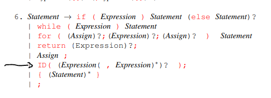
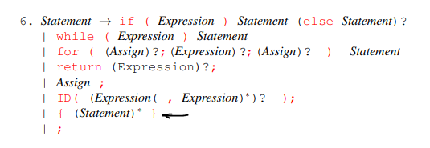
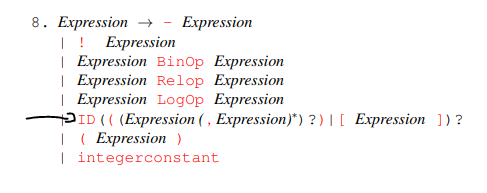

### A regra 6 da gramática da professora (produções para statement) tem a seguinte produção:

ID( (Expression( , Expression)∗)? );
O que nos permite gerar chamadas de funções como nos exemplos: x(); x(2); x(2+2, 3, 4);
<br>O detalhe é que apenas os parenteses mais externos são produzidos



Já a regra que seria equivalente no nosso trabalho é a seguinte (linha 48 do `grammar.json`):  

```"ID LPAREN possibleExpression_comma RPAREN SEMICOLON"```
onde o `possibleExpression_comma` produz: `""` ou `"LPAREN Expression commaExpression RPAREN"`

Ele abre parenteses mais uma vez!! O que nos permite gerar x((2)); por exemplo

### Na mesma regra da gramática da professora a produção seguinte é a destacada:


já a nossa produção equivale seria a linha 49 que produz: `"LPAREN possiblTtatement RPAREN"`. Ou seja, produzimos parenteses ao invés de {}!


### A regra 8 da gramática da professora (produções para expression) tem a seguinte produção:


Note que por essa produção temos algumas possibilidades:
- Gerar `id`
- Gerar `id[expression]`
- Gerar `id(Expression)`
- Gerar `id(Expression, Expression, ... Expression)`
- Note que também podemos gerar `id()` e isso nossa regra equivalente (linha 64):
`ID IDCall` não permite

<br>Quando decidimos seguir o caminho dos parênteses temos, em `IdCall`, que escolher produzir `possibleExpression_comma`
Em `possibleExpression_comma` temos 2 opções, `"" ou "LPAREN Expression commaExpression RPAREN"` 
<br>Ao escolher a segunda, não conseguimos gerar ``id()``, apenas `id(Expression)` ou `id(Expression, Expression, ... Expression)`